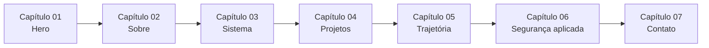
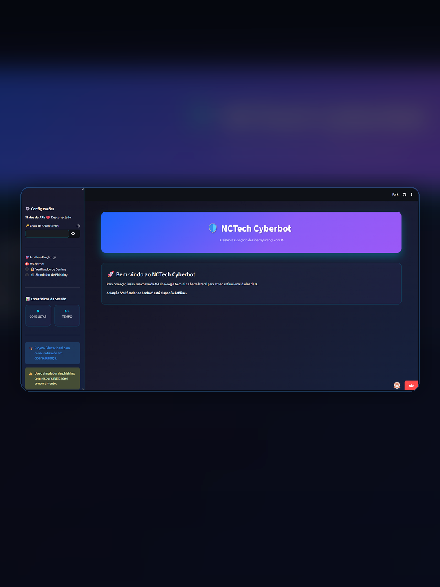
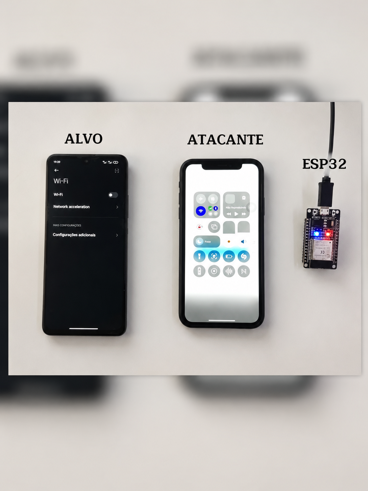
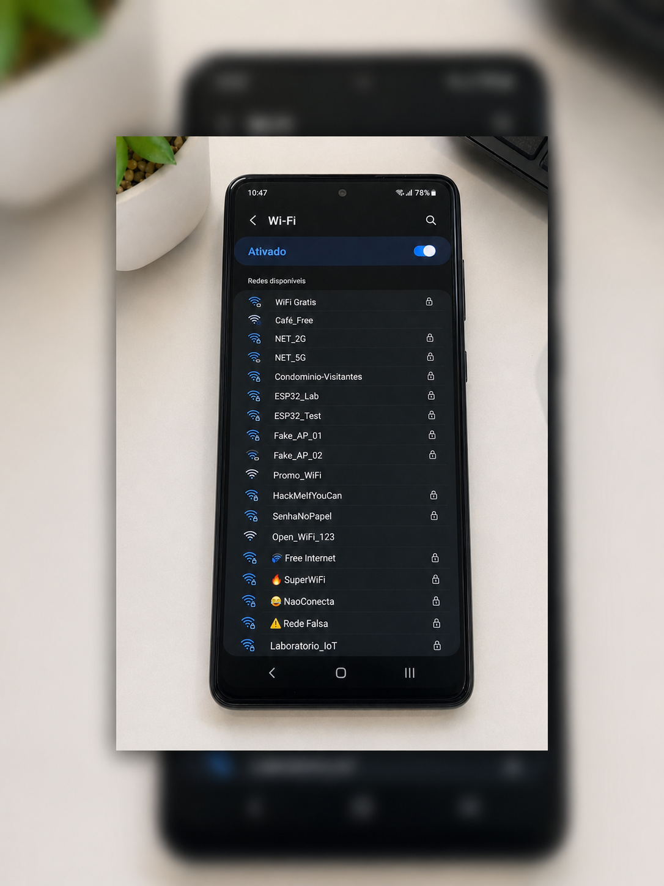
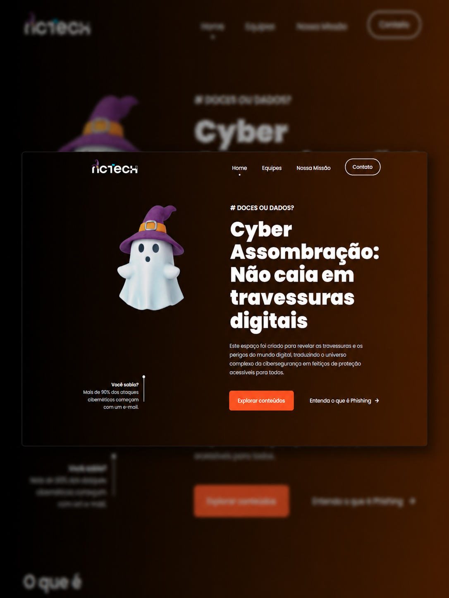
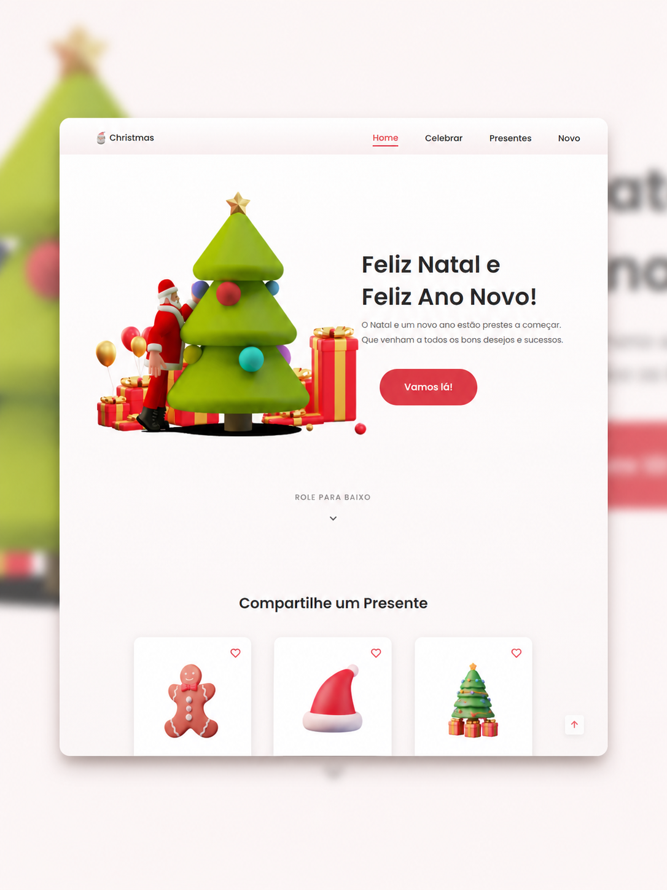
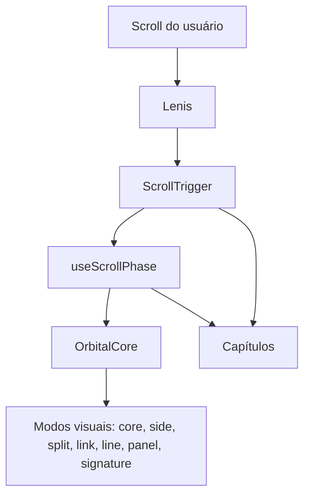
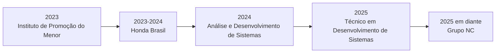

  <h1>Iann Arthur Martaroli</h1>
  

    <strong>Desenvolvedor com foco em interfaces bem resolvidas, sistemas claros e cibersegurança aplicada.</strong>
  

  

    Este repositório reúne o código do meu portfólio pessoal, pensado como uma experiência de
    scrollytelling em sete capítulos.
  

  

    <a href="https://github.com/iannxz">GitHub</a>
    ·
    <a href="https://www.linkedin.com/in/iannarthur/">LinkedIn</a>
  

  
  
  
  
  
  

## Visão

Este não é um README de instalação. É uma peça de apresentação.

O objetivo deste portfólio não foi só listar projetos, mas construir uma narrativa visual sobre
quem eu sou, como penso interface, como organizo informação e de que forma a segurança entra na
minha prática técnica. A página foi desenhada como uma experiência contínua: o fundo reage ao
scroll, a leitura acontece por capítulos e cada seção muda o ritmo da navegação.

<table>
  <tr>
    <td width="25%" align="center">
      <strong>Formato</strong> 
      Single-page 
      scrollytelling
    </td>
    <td width="25%" align="center">
      <strong>Estrutura</strong> 
      7 capítulos 
      conectados por motion
    </td>
    <td width="25%" align="center">
      <strong>Direção</strong> 
      Desenvolvimento 
      + segurança aplicada
    </td>
    <td width="25%" align="center">
      <strong>Base técnica</strong> 
      React, TypeScript, 
      Vite, Tailwind e GSAP
    </td>
  </tr>
</table>

## Mapa da experiência

## O que este portfólio procura comunicar

<table>
  <tr>
    <td width="33%" valign="top">
      <strong>Narrativa antes de vitrine</strong>  
      Em vez de apresentar blocos soltos, a página conduz a leitura. Cada capítulo tem função,
      ritmo e transição próprios.
    </td>
    <td width="33%" valign="top">
      <strong>Motion como estrutura</strong>  
      As animações não entram como enfeite. Elas ajudam a organizar hierarquia, progressão e foco
      visual ao longo do scroll.
    </td>
    <td width="33%" valign="top">
      <strong>Segurança como repertório real</strong>  
      O trabalho com Blue Team, EDR/XDR, SOAR, hardening e análise de vulnerabilidades aparece
      como parte do meu pensamento técnico, não como palavra-chave isolada.
    </td>
  </tr>
</table>

## Galeria de projetos

<table>
  <tr>
    <td width="50%" align="center" valign="top">
      
       
      <strong>Cyberbot</strong>
       
      Protótipo com Python, Streamlit e LLMs voltado a apoio em tarefas e estudos de cibersegurança.
    </td>
    <td width="50%" align="center" valign="top">
      
       
      <strong>ESP32 Phishing</strong>
       
      Lab controlado para estudo de segurança, redes e comportamento de dispositivos com ESP32.
    </td>
  </tr>
  <tr>
    <td width="50%" align="center" valign="top">
      
       
      <strong>ESP32 Beacon Spam</strong>
       
      Experimento técnico para observar sinais, broadcast e comportamento de redes wireless.
    </td>
    <td width="50%" align="center" valign="top">
      
       
      <strong>Landing Page Cibersegurança</strong>
       
      Projeto front-end construído para explorar linguagem visual, interface e comunicação temática.
    </td>
  </tr>
  <tr>
    <td colspan="2" align="center" valign="top">
      
       
      <strong>Landing Page Feliz Natal</strong>
       
      Projeto visual e interativo criado para exercitar criatividade, ritmo de interface e experiência do usuário.
    </td>
  </tr>
</table>

## Arquitetura da experiência

O núcleo visual do projeto gira em torno de três decisões:

- o fundo orbital em canvas muda de comportamento conforme o capítulo ativo
- o estado global de scroll coordena interação, ritmo e atmosfera visual
- os capítulos não funcionam como páginas separadas, mas como partes de uma mesma composição

## Percurso profissional retratado no site

- Instituto de Promoção do Menor: comunicação, ética, organização e postura corporativa.
- Honda Brasil: contato com rotina corporativa, gestão ambiental e processos.
- ADS: base em lógica, arquitetura e desenvolvimento.
- SENAI São Paulo: aprofundamento prático em desenvolvimento de sistemas.
- Grupo NC: atuação em Blue Team, EDR/XDR, SOAR, firewall, hardening e análise de vulnerabilidades.

## Stack e repertório

### Desenvolvimento

  
  
  
  
  
  
  
  

### Cibersegurança

  
  
  
  
  
  
  
  
  
  

### Cloud, dados e ferramentas

  
  
  
  
  
  
  
  

## Formação, certificações e destaque

- Análise e Desenvolvimento de Sistemas.
- Técnico em Desenvolvimento de Sistemas.
- Atuação prática em ambiente corporativo com foco em segurança.
- Selecionado em concurso de inglês Microsoft × SENAI Sumaré, com bolsa concedida a apenas 20 estudantes da região.

  
<strong>Ver certificações e cursos em destaque</strong>

   

  - JWT Attacks and Detection — LetsDefend
  - Obfuscated JavaScript — LetsDefend
  - Malware Analyzer — LetsDefend
  - Certified Phishing Prevention Specialist — Hack & Fix
  - Programação em Python para Cibersegurança — SENAI
  - Fundamentos de Segurança em Nuvem (SC-900) — Microsoft
  - Implantação de IA em Nuvem (AI-900) — Microsoft
  - Implementação de Serviços em Nuvem (AZ-900) — Microsoft
  - Python Essentials 1 — Cisco
  - Introduction to Cybersecurity — Cisco
  - Computer Hardware Basics — Cisco
  - Introdução ao Hacking e Pentest 2.0 — Solyd Offensive Security
  - Design UX/UI — SENAI
  - Banco de Dados para Data Science — SENAI
  - Soluções Integradas com IoT — SENAI
  - Aplicativos Low Code (Oracle APEX) — Oracle
  - Microsoft Power BI — SENAI
  - Ética na Inteligência Artificial — SENAI

## Encerramento

Este portfólio foi construído para mostrar repertório técnico, direção visual e clareza de pensamento
no mesmo lugar. Ele fala de desenvolvimento, mas também de processo, critério e segurança.

Se você quiser conversar sobre projetos, oportunidades ou tecnologia, os links estão aqui:

- GitHub: https://github.com/iannxz
- LinkedIn: https://www.linkedin.com/in/iannarthur/
